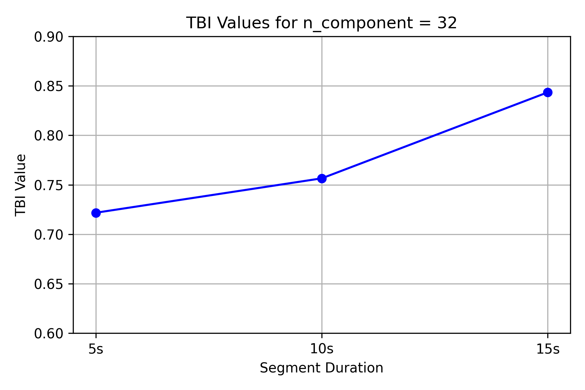
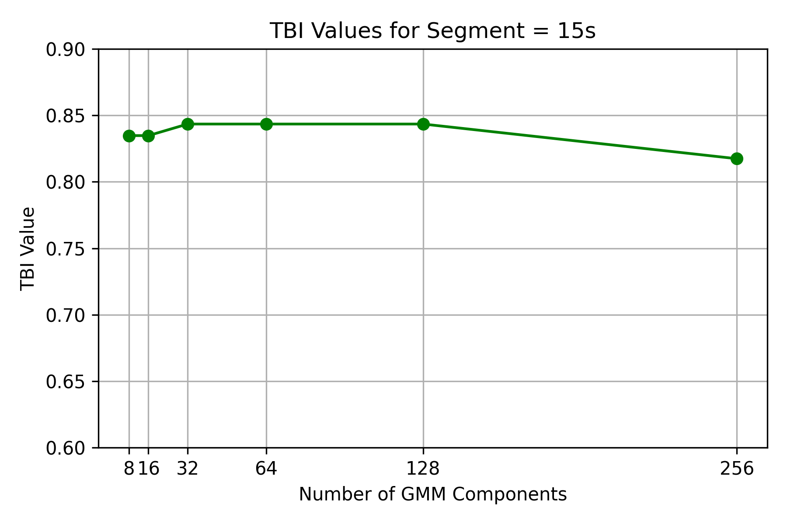

# Speaker Verification and Recognition System

A comprehensive speaker verification and recognition system using Gaussian Mixture Models (GMM) and Mel-Frequency Cepstral Coefficients (MFCC) for audio feature extraction.

## 🎯 Project Overview

This project implements a robust speaker verification and recognition system that can:
- **Identify speakers** from audio samples (Speaker Identification)
- **Verify claimed speaker identity** against voice biometrics (Speaker Verification)
- **Process various audio segment lengths** (5s, 10s, 15s)
- **Achieve high accuracy** with optimized GMM configurations

## 📊 Key Results

### Best Performance Metrics
- **Speaker Identification Rate (TBI)**: Up to **84.35%** accuracy
- **Equal Error Rate (EER)**: As low as **19.44%** for verification
- **Optimal Configuration**: 32-128 GMM components with 15-second audio segments

### Performance by Segment Duration
| Segment Duration | Best TBI | Best EER | Optimal Components |
|------------------|----------|----------|-------------------|
| 5 seconds        | 73.91%   | 22.80%   | 256 components    |
| 10 seconds       | 77.39%   | 27.52%   | 64 components     |
| 15 seconds       | 84.35%   | 19.44%   | 32-128 components |

## 🏗️ System Architecture

### Data Pipeline
```
Raw Audio → Silence Removal → MFCC Extraction → GMM Training → Speaker Models
                ↓
Audio Segments → Feature Vectors → Likelihood Scores → Classification/Verification
```

### Key Components
1. **Voice Activity Detection (VAD)**: WebRTC VAD for silence removal
2. **Feature Extraction**: 12-dimensional MFCC coefficients (excluding energy)
3. **Modeling**: Gaussian Mixture Models with diagonal covariance
4. **Evaluation**: Both identification and verification metrics

## 📁 Project Structure

```
PROJECT1/
├── Dataset_RAL/                    # Original audio dataset
│   └── Reconnaissance_du_locuteur/
│       ├── F1-F13/                # Female speakers
│       └── H1-H9/                 # Male speakers
│           ├── Train/             # Training audio files
│           └── Test/              # Test audio files
│               ├── 5s/            # 5-second segments
│               ├── 10s/           # 10-second segments
│               └── 15s/           # 15-second segments
├── Dataset_nosilence/             # Processed audio (silence removed)
├── MFCC/                         # Extracted MFCC features
├── GMM/                          # Trained GMM models
├── COURBES DET/                  # DET curves and EER plots
├── TBI_Plots_By_Component/       # TBI performance by components
├── TBI_Plots_By_Segment/         # TBI performance by segments
└── Project notebook.ipynb       # Main implementation
```

## 🔬 Technical Implementation

### 1. Audio Preprocessing
- **Sampling Rate**: 16 kHz (optimized for WebRTC VAD)
- **Frame Duration**: 30ms frames for VAD processing
- **Silence Removal**: WebRTC VAD with mode 3 (most strict)

### 2. Feature Extraction
- **MFCC Coefficients**: 12 dimensions (excluding C0 energy coefficient)
- **Feature Processing**: Direct extraction from cleaned audio signals
- **Normalization**: Features saved in CSV format for model training

### 3. Model Training
- **Algorithm**: Gaussian Mixture Models with diagonal covariance
- **Components Tested**: 8, 16, 32, 64, 128, 256 mixtures
- **Training Strategy**: Gender-specific model groups for improved accuracy
- **Model Persistence**: Joblib serialization for trained models

### 4. Evaluation Methodology
#### Speaker Identification
- **Metric**: TBI (Taux de Bonne Identification) - Correct Identification Rate
- **Method**: Maximum likelihood selection among same-gender models
- **Test Data**: Multiple segment durations per speaker

#### Speaker Verification
- **Metrics**: FAR (False Accept Rate), FRR (False Reject Rate), EER (Equal Error Rate)
- **Threshold Optimization**: Grid search from -136 to -43 (likelihood range)
- **DET Curves**: Generated for all component-segment combinations

## 📈 Performance Analysis

### Speaker Identification Results

The system shows consistent improvement with longer audio segments:

- **5-second segments**: Performance ranges from 71.3% to 73.9% TBI
- **10-second segments**: Performance ranges from 73.9% to 77.4% TBI
- **15-second segments**: Performance ranges from 81.7% to 84.4% TBI

### Speaker Verification Results

Best verification performance achieved:
- **Lowest EER**: 19.44% (256 components, 15s segments)
- **Most Stable**: 32-128 components across different segment lengths
- **Threshold Range**: Optimal thresholds between -56.5 and -52.5

## 🖼️ Visual Results

### TBI Performance by Components

*Performance comparison across different GMM component counts*

### TBI Performance by Segment Duration

*Identification accuracy for different audio segment lengths*

### DET Curves for Best Configuration

*Detection Error Tradeoff curve showing FAR vs FRR for optimal configuration*

### Overall EER Comparison

*Equal Error Rate comparison across all configurations*

## ⚙️ Requirements

### Python Dependencies
```python
webrtcvad          # Voice Activity Detection
librosa            # Audio processing
numpy              # Numerical computations
soundfile          # Audio I/O
scikit-learn       # Machine Learning (GMM)
joblib             # Model serialization
pandas             # Data manipulation
matplotlib         # Plotting
```

### System Requirements
- **Python**: 3.7+
- **Audio Format**: WAV files, 16 kHz sampling rate
- **Memory**: Sufficient RAM for loading multiple audio files
- **Storage**: Space for processed features and models

## 🚀 Usage

### 1. Data Preparation
```python
# Process audio files (remove silence + extract MFCC)
INPUT_DIR = "Dataset_RAL/Reconnaissance_du_locuteur"
OUTPUT_DIR = "Dataset_nosilence"
OUTPUT_MFCC_DIR = "MFCC"
process_audio_files(INPUT_DIR, OUTPUT_DIR, OUTPUT_MFCC_DIR)
```

### 2. Model Training
```python
# Train GMM models for all speakers
mfcc_dir = "MFCC"
output_model_dir = "GMM"
train_gmm_for_speakers(mfcc_dir, output_model_dir)
```

### 3. Evaluation
```python
# Speaker Identification
TBI_results = evaluate(gmm_dir, mfcc_dir)

# Speaker Verification
verification_data = evaluate_verification(gmm_dir, mfcc_dir)
```

## 📝 Dataset Information

### Speaker Distribution
- **Female Speakers**: F1 through F13 (13 speakers)
- **Male Speakers**: H1 through H9 (9 speakers)
- **Total**: 22 speakers with gender-balanced representation

### Data Split
- **Training**: Single audio file per speaker for model training
- **Testing**: Multiple segments (5s, 10s, 15s) for comprehensive evaluation
- **Total Test Samples**: 1,151 test samples across all configurations

## 🔍 Key Findings

1. **Segment Duration Impact**: Longer audio segments significantly improve performance
2. **Optimal Component Count**: 32-128 GMM components provide best balance of accuracy and efficiency
3. **Gender-Specific Modeling**: Same-gender model comparison improves discrimination
4. **Feature Robustness**: MFCC features prove effective for speaker characterization
5. **Verification vs Identification**: EER around 19-20% achievable for verification tasks

## 🎯 Applications

This system can be applied to:
- **Security Systems**: Biometric authentication using voice
- **Call Centers**: Automatic speaker identification for customer service
- **Forensics**: Speaker identification in legal investigations
- **Smart Devices**: Voice-controlled personal assistants
- **Access Control**: Voice-based building or system access

## 📚 References

The implementation is based on established techniques in speaker recognition:
- Gaussian Mixture Models for speaker modeling
- MFCC feature extraction for speech characterization
- WebRTC VAD for robust voice activity detection
- Standard evaluation metrics (TBI, EER, DET curves)

## 👥 Contributors

- **Wiame Adnane** - Implementation and Analysis

---

*This project demonstrates the effectiveness of GMM-based speaker recognition systems and provides a comprehensive evaluation framework for speaker verification applications.*